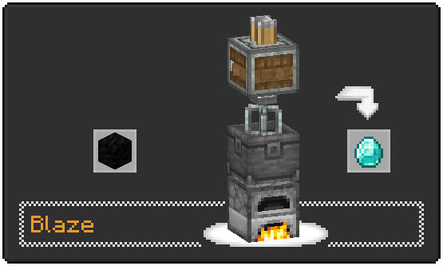

<div align="center">

# Create Heat JS


[![curseforge-badge]][curseforge-url] [![modrinth-badge]][modrinth-url] [![github-badge]][github-url]
</div>

Allow to use KubeJS customize Create's Heat Source Block, HeatLevel.

Please use [KubeJS Create Mod](https://modrinth.com/mod/kubejs-create/) when adding recipes, and use the `.heatLevel()` method to set the heat level.

## Example



### Client Scripts

```js
ClientEvents.lang("en_us", (event) => {
  event.add("create.recipe.heat_requirement.pyrotheum", "Pyrotheum");
  event.add("create.recipe.heat_requirement.blaze", "Blaze");
});
```

### Server Scripts

```js
ServerEvents.recipes((event) => {
  event.recipes.create.mixing("diamond", "coal_block").heatLevel("BLAZE");
  event.recipes.create.compacting("diamond", "coal_block").heatLevel("BLAZE");
});
```

### Startup Scripts

```js
const $AbstractFurnaceBlock = Java.loadClass("net.minecraft.world.level.block.AbstractFurnaceBlock");

CreateHeatJS.registerHeatEvent((event) => {
  event.registerHeatLevel("BLAZE", 3, 0xed9c33);
  event.registerHeatSource("BLAZE", "minecraft:furnace[facing=north,lit=true]");
  event.registerHeatSource("BLAZE", "minecraft:fire");
  event.registerHeatSource("PYROTHEUM", "minecraft:furnace[facing=south,lit=false]", (blockState) => {
    if (blockState.hasProperty($AbstractFurnaceBlock.LIT)) {
      return blockState.getValue($AbstractFurnaceBlock.LIT).booleanValue();
    }
  });
});
```

[curseforge-badge]: https://raw.githubusercontent.com/intergrav/devins-badges/v3/assets/cozy/available/curseforge_vector.svg
[curseforge-url]: https://www.curseforge.com/minecraft/mc-mods/create-heat-js
[modrinth-badge]: https://raw.githubusercontent.com/intergrav/devins-badges/v3/assets/cozy/available/modrinth_vector.svg
[modrinth-url]: https://modrinth.com/mod/create-heat-js
[github-badge]: https://raw.githubusercontent.com/intergrav/devins-badges/v3/assets/cozy/available/github_vector.svg
[github-url]: https://github.com/XiaoHuNao/CreateHeatJS
